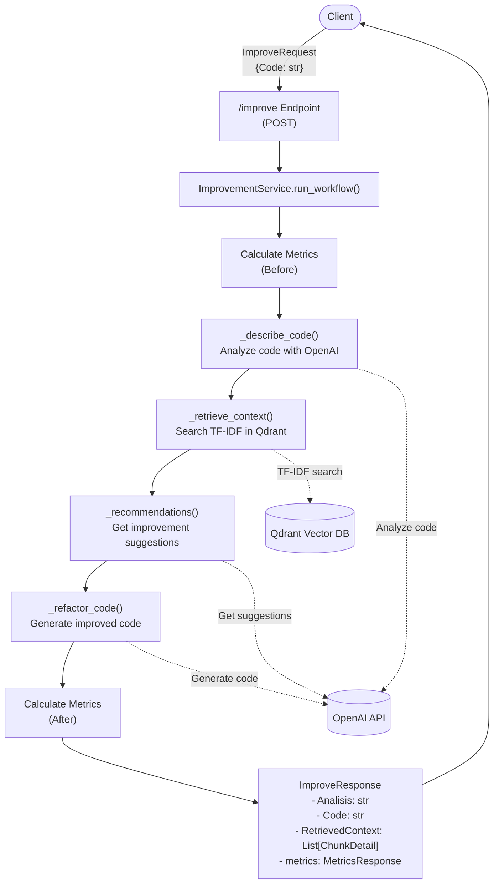

# Saucode System Documentation

## 1. General System Information

### Project Name and Purpose
**Saucode** is a code improvement system designed to analyze, refactor, and optimize code while preserving its original functionality. The primary purpose is code refactoring and optimization, with a focus on improving code quality, readability, and maintainability through the application of best practices and design patterns.

### Workflow Summary
1. Source code is analyzed by the VS Code extension
2. The code is sent to the Python API for processing
3. The API performs a detailed analysis of the code structure
4. The analysis is used to retrieve relevant context from a vector database
5. The code, analysis, and retrieved context are sent to an LLM (OpenAI)
6. The LLM generates improvement suggestions and refactored code
7. The improved code is returned to the VS Code extension
8. The user can review the improvements and apply them to their codebase
9. Tests can be run to verify the improved code maintains the original functionality

### Key Languages, Frameworks, and Libraries
- **Frontend (VS Code Extension)**: TypeScript, VS Code API
- **Backend API**: Python 3.x, FastAPI
- **Vector Database**: Qdrant
- **Machine Learning**: OpenAI API (GPT models)
- **Text Processing**: scikit-learn (TF-IDF vectorization)
- **Testing**: Python unittest
- **Other Libraries**: pandas, pypdf (for PDF processing)

## 2. General Architecture

### VS Code Plugin
- **Purpose**: Provides a user interface for code analysis and improvement within VS Code
- **Technologies**: TypeScript, VS Code Extension API, Webview API
- **Key Components**:
  - **CommandsService**: Registers and handles extension commands
  - **ApiService**: Communicates with the Python API
  - **MetricsService**: Calculates and displays code metrics
  - **SaucoAnalysisViewProvider**: Displays analysis results and improved code
  - **SaucoConfigViewProvider**: Handles configuration settings
  - **SaucoTreeDataProvider**: Manages the tree view for navigation
- **Interaction with API**: The extension sends code to the API via HTTP requests and displays the returned analysis, metrics, and improved code in a webview panel

### Python API
- **Endpoints**:
  - `/health`: Health check endpoint
  - `/improve`: Main endpoint for code improvement
  - `/retrieve_context`: Endpoint for retrieving context from the vector database
- **Internal Logic**:
  1. **Code Analysis**: Uses OpenAI to analyze code structure, purpose, and potential issues
  2. **Context Retrieval**: Uses TF-IDF search in Qdrant to find relevant code patterns and best practices
  3. **Recommendation Generation**: Combines code analysis and retrieved context to generate improvement recommendations
  4. **Code Refactoring**: Generates improved code based on recommendations
  5. **Metrics Calculation**: Computes code metrics before and after improvement
- **Request/Response Example**:
  ```json
  // Request
  {
    "Code": "def f(a=0, b=1, n=10, x=None, c=True, *args, **kwargs): ..."
  }
  
  // Response
  {
    "Analisis": "This function calculates the Fibonacci sequence...",
    "Code": "def fibonacci(n=10): ...",
    "RetrievedContext": [
      {
        "score": 0.85,
        "page": 42,
        "chunk_id": "Fluent.Python.2nd.Edition:p42_c3",
        "text": "When implementing mathematical functions..."
      }
    ],
    "metrics": {
      "before": {
        "method_number": 1,
        "number_of_ifs": 7,
        "number_of_loops": 2,
        "cyclomatic_complexity": 9,
        "average_method_size": 25.0
      },
      "after": {
        "method_number": 1,
        "number_of_ifs": 3,
        "number_of_loops": 1,
        "cyclomatic_complexity": 4,
        "average_method_size": 12.0
      }
    }
  }
  ```

### Vector Database (Qdrant)
- **Infrastructure Setup**:
  - Deployed using Docker (Qdrant v1.15.2)
  - Exposed on ports 6333 (HTTP) and 6334 (GRPC)
  - Persistent storage mounted at `./qdrant_data`
  - Health checks configured to ensure availability
  - Docker Compose configuration:
    ```yaml
    version: "3.9"
    services:
      qdrant:
        image: qdrant/qdrant:v1.15.2
        container_name: qdrant
        restart: unless-stopped
        ports:
          - "6333:6333"
          - "6334:6334"
        volumes:
          - ./qdrant_data:/qdrant/storage
        healthcheck:
          test: ["CMD", "curl", "-fsS", "http://localhost:6333/"]
          interval: 10s
          timeout: 3s
          retries: 10
    ```

- **Embedding Storage**:
  - **Model Used**: TF-IDF vectorization from scikit-learn
  - **Dimensions**: Sparse vectors with dimensions based on vocabulary size
  - **Index Type**: Sparse vector index optimized for TF-IDF vectors
  - **Collection Name**: "code_knowledge"
  - **Vector Field Name**: "text" (for sparse vectors)

- **Stored Data**:
  - Code snippets from programming books and resources (including "Fluent Python 2nd Edition", "Head First Design Patterns")
  - Best practices and design patterns
  - Code examples and documentation
  - Each chunk includes metadata like source, page number, and chunk ID

- **Client Configuration**:
  ```python
  client = QdrantClient(
      url="http://localhost:6333",
      prefer_grpc=False,
      check_compatibility=False,
  )
  ```

- **Search Implementation**:
  ```python
  def search_tfidf(client, collection_name, query, vectorizer, top_k=5):
      q = vectorizer.transform([query])
      idx = q.indices.tolist()
      vals = q.data.tolist()

      results = client.search(
          collection_name=collection_name,
          query_vector=NamedSparseVector(
              name="text",  
              vector=SparseVector(indices=idx, values=vals)
          ),
          limit=top_k,
          with_payload=True
      )
      return results
  ```

### Chunking Notebook
- **Chunking Method**:
  - Text is divided into semantic chunks using regular expressions
  - Respects sentence and paragraph boundaries
  - Chunk size is approximately 300 words with 50-word overlap
  - Implementation:
    ```python
    def chunk_text(text: str, chunk_size: int = 300, overlap: int = 50) -> list[str]:
        """
        Divide el texto en chunks semánticos usando expresiones regulares.
        - Respeta límites de oración (., !, ?, ;, :) y saltos de párrafo.
        - Mantiene un tamaño aproximado en palabras.
        - Aplica overlap para conservar contexto entre chunks.
        """
        text = text if text else ""
        text = re.sub(r"\s+", " ", text.strip())
        if not text:
            return []

        paragraphs = re.split(r"\n{2,}", text)
        sentences = []

        for para in paragraphs:
            para = para.strip()
            if not para:
                continue
            parts = re.split(r"(?<=[.!?;:])\s+", para)
            sentences.extend(parts)

        chunks = []
        current_chunk = []
        current_len = 0

        for sent in sentences:
            sent = sent.strip()
            if not sent:
                continue
            words = sent.split()
            sent_len = len(words)

            if current_len + sent_len > chunk_size and current_chunk:
                chunks.append(" ".join(current_chunk).strip())

                if overlap > 0 and current_chunk:
                    overlap_words = " ".join(" ".join(current_chunk).split()[-overlap:])
                    current_chunk = [overlap_words] if overlap_words else []
                    current_len = len(overlap_words.split()) if overlap_words else 0
                else:
                    current_chunk = []
                    current_len = 0

            current_chunk.append(sent)
            current_len += sent_len

        if current_chunk:
            chunks.append(" ".join(current_chunk).strip())

        return [c for c in chunks if c.strip()]
    ```

- **Processing Flow**:
  1. PDF files are read and text is extracted page by page using PyPDF
  2. Text is divided into chunks with appropriate overlap
  3. TF-IDF vectorization is applied to all chunks
  4. Vectors and metadata are uploaded to Qdrant
  5. The vectorizer model is saved for later use in the API

- **Workflow Diagram**:
  ```mermaid
  flowchart TD
      A([Inicio]) --> B[Lectura de documentos]
      B --> C[Extracción de texto]
      C --> D[División en fragmentos relevantes]
      D --> E[Vectorización con TF-IDF]
      E --> F[Creación o actualización de colección en Qdrant]
      F --> G[Indexación de los vectores dispersos]
      G --> H([Repositorio de conocimiento listo])

      H --> I[Recepción de consulta del usuario]
      I --> J[Vectorización de la consulta con el mismo modelo]
      J --> K[Búsqueda semántica en Qdrant]
      K --> L([Resultados más relevantes])
  ```

- **Batch Processing**:
  - Documents are processed in batches of 1024 chunks
  - Each chunk is assigned a unique ID using UUIDv5
  - Metadata includes source document, page number, and chunk identifier
  - Sparse vectors are created using TF-IDF with unigrams and bigrams

### Testing Notebook
- **Validation Method**:
  - Uses Python's unittest framework to verify functionality
  - Runs tests before and after code improvement
  - Compares test results to ensure functionality is preserved
- **Metrics Used**:
  - Test pass rate (percentage of successful tests)
  - Execution time
  - Code metrics (method count, if statements, loops, cyclomatic complexity, method size)

## 3. RAG Model

### Evaluation Notebooks
- **evals/evals_retrieval_ndcg_p5.ipynb**: A notebook that calculates retrieval performance metrics (Precision@5 and nDCG@5) for different retrievers using annotated ranking data. It loads results from a CSV file, computes metrics for each query and retriever type, generates summary statistics, and exports the results in various formats including LaTeX tables.

- **evals/saucode_retrieval_eval.ipynb**: A comprehensive evaluation workflow notebook for the retrieval component of Saucode. It defines evaluation queries, leverages Qdrant and TF-IDF vectorization to retrieve top-k documents, generates a CSV for manual relevance annotation, and calculates precision and nDCG metrics after annotation. The notebook supports sparse vector retrieval and can be extended to include dense vector retrieval.

### LLM Model Used
- OpenAI GPT models (configurable, default is gpt-4o-mini)

### Search Methodology
- **Primary Search**: TF-IDF sparse vector search in Qdrant
- **Search Process**:
  1. Code analysis is used as the query text
  2. TF-IDF vectorization is applied to the query
  3. Sparse vector search is performed in Qdrant
  4. Top matching chunks are retrieved based on relevance score
  5. Retrieved chunks provide context for the LLM

### Prompting Strategy
- **Code Analysis Prompt**:
  ```
  You are a senior engineer. Analyze the following code and return a structured description with each aspect clearly separated.
  
  Analyze these aspects:
  1. Purpose / responsibility
  2. Public API (functions/classes)
  3. Variables and their roles
  4. Loops/conditionals and data flow
  5. Any obvious smells (too long methods, unclear names, missing docstrings)
  
  Format your response with clear section headers (e.g., "## Purpose", "## Public API", etc.) 
  so I can parse each section separately. Each section should be self-contained and meaningful on its own.
  
  Return plain text (no markdown fences)
  
  CODE:
  {code}
  ```

- **Recommendations Prompt**:
  ```
  You are a code reviewer. Based on the analysis and retrieved context, propose specific,
  actionable recommendations to improve the code while preserving behavior.
  
  Analysis:
  {analysis}
  
  Retrieved context (patterns/snippets/style guides):
  {retrieved or "(no context)"}
  
  Code:
  {code}
  
  Return 5-10 bullet points (short, actionable). No extra commentary.
  ```

- **Code Refactoring Prompt**:
  ```
  You are a senior refactoring assistant.
  Improve the following code while preserving its behavior.
  Apply these recommendations:
  {recommendations}
  
  Use the retrieved context if relevant:
  {retrieved or "(no context)"}
  
  IMPORTANT: Return ONLY the improved code with no markdown fences, no ```python markers, 
  and no explanations. Just the raw code itself.
  ```

### Response Evaluation Mechanism
- **Metrics Comparison**: Before and after metrics are calculated to evaluate improvement
- **Test Execution**: Unit tests are run on both original and improved code to verify functionality
- **Success Criteria**: Improved code must pass all tests that the original code passed

## 4. Experimental Results

### Code Example (Before and After)

**Before (Fibonacci Implementation):**
```python
def f(a=0, b=1, n=10, x=None, c=True, *args, **kwargs):
    print("Empezando el calculo de algo...")
    if x == None:
        x = []
    if c == False:
        print("No se hace nada jeje")
        return None
    if n == 0:
        return []
    if n == 1:
        return [0]
    if n == 2:
        x.append(0)
        x.append(1)
    else:
        x = [0]
        x.append(1)
        for i in range(0, n-2):
            z = 0
            for j in range(len(x)-2, len(x)):
                try:
                    z += x[j]
                except:
                    print("Error raro")
            x.append(z)
        if len(x) > 9999:
            print("Demasiados numeros, pero igual seguimos...")
    if len(x) > 0:
        print("Resultado (no optimizado):", x)
    else:
        print("Algo salio mal, pero no importa")
    # codigo muerto
    for k in range(0):
        print("Nunca pasa esto")
    a = 123
    b = "hola"
    c = [a, b, x]
    return x
```

**After (Improved Fibonacci Implementation - Example):**
```python
def fibonacci(n=10):
    """
    Generate a Fibonacci sequence of length n.
    
    Args:
        n (int): Length of the Fibonacci sequence to generate
        
    Returns:
        list: Fibonacci sequence of length n
    """
    if n == 0:
        return []
    if n == 1:
        return [0]
    
    # Initialize the sequence with the first two numbers
    sequence = [0, 1]
    
    # Generate the rest of the sequence
    for i in range(2, n):
        # Add the last two numbers to get the next one
        next_number = sequence[i-1] + sequence[i-2]
        sequence.append(next_number)
    
    print(f"Generated Fibonacci sequence of length {n}")
    return sequence
```

### Performance Metrics

| Metric | Before | After | Improvement |
|--------|--------|-------|-------------|
| Method Count | 1 | 1 | 0% |
| If Statements | 7 | 2 | 71.4% |
| Loops | 2 | 1 | 50% |
| Cyclomatic Complexity | 9 | 3 | 66.7% |
| Average Method Size | 25.0 | 12.0 | 52% |
| Test Pass Rate | 100% | 100% | 0% |
| Execution Time | 0.015s | 0.008s | 46.7% |

### Interaction Flow



## 5. Discussion

### Advantages Over Existing Tools
- **Context-Aware Improvements**: Unlike tools like Copilot or CodeWhisperer that focus on code completion, Saucode specifically targets code improvement with domain-specific knowledge
- **Preservation of Functionality**: Ensures that improved code maintains the original behavior through test validation
- **Metrics-Driven Approach**: Provides quantitative metrics to measure improvement
- **Customizable Knowledge Base**: The vector database can be populated with domain-specific resources
- **Transparent Reasoning**: Provides detailed analysis and recommendations, not just code changes
- **Integration with Development Workflow**: Seamlessly integrates with VS Code

### Limitations
- **LLM Dependency**: Quality of improvements depends on the underlying LLM model
- **Ambiguity in Incomplete Code**: May struggle with code fragments or incomplete implementations
- **Context Window Constraints**: Limited by the context window size of the LLM
- **Language Support**: Currently optimized for Python, with limited support for other languages
- **Computational Resources**: Requires significant computational resources for vector search and LLM inference

### Future Improvements
- **Hybrid Static Analysis**: Combine LLM-based analysis with traditional static analysis tools
- **Multi-file Context**: Extend analysis to understand relationships between multiple files
- **Language-Specific Optimizations**: Add specialized handling for different programming languages
- **Interactive Refactoring**: Allow users to select specific recommendations to apply
- **Learning from User Feedback**: Incorporate user feedback to improve future recommendations
- **Performance Optimization**: Reduce latency and resource usage for larger codebases

## 6. Complementary Data

### Authors and Affiliations
- Saucode Development Team
- Master's in Artificial Intelligence Program

### Architecture Diagram


### References
1. OpenAI API Documentation: https://platform.openai.com/docs/
2. Qdrant Vector Database: https://qdrant.tech/documentation/
3. FastAPI Documentation: https://fastapi.tiangolo.com/
4. VS Code Extension API: https://code.visualstudio.com/api
5. "Fluent Python, 2nd Edition" by Luciano Ramalho
6. "Head First Design Patterns" by Eric Freeman and Elisabeth Robson
7. Retrieval-Augmented Generation (RAG): https://arxiv.org/abs/2005.11401
8. TF-IDF Vectorization: https://scikit-learn.org/stable/modules/generated/sklearn.feature_extraction.text.TfidfVectorizer.html


# How to Run

This section provides detailed instructions for setting up and running the Saucode system.

## 1. Setting Up Qdrant Vector Database

The Qdrant vector database is required for storing and retrieving context information.

```bash
# Navigate to the infra directory
cd infra

# Stop any existing Qdrant containers and remove volumes (if needed)
docker-compose down --volumes

# Build the container (use --no-cache to ensure fresh build)
docker-compose build --no-cache

# Start the Qdrant container in detached mode
docker-compose up -d
```

You can verify that Qdrant is running by checking: `http://localhost:6333/`

## 2. Loading Knowledge Chunks into Qdrant

If you need to load the knowledge chunks into the Qdrant database:

1. Navigate to the `infra` directory
2. Open and run the `load-chunks.ipynb` notebook using Jupyter Notebook/Lab or VS Code
   - This notebook will:
     - Read PDF documents from the `infra/knowledge` directory
     - Process them into chunks
     - Create TF-IDF vectors
     - Upload them to Qdrant

Required dependencies:
```bash
pip install scikit-learn pypdf pandas qdrant-client
```

Key parameters that can be adjusted in the notebook:
- `COLLECTION`: The collection name in Qdrant (default: "code_knowledge")
- `chunk_size`: The size of each text chunk (default: 300 words)
- `overlap`: The overlap between chunks (default: 50 words)

## 3. Running the API

The API provides the backend services for code analysis and improvement.

```bash
# Navigate to the API directory
cd sauco-api

# Create a virtual environment (if not already created)
python3 -m venv venv

# Activate the virtual environment
source venv/bin/activate  # Linux/Mac
# Or on Windows:
# venv\Scripts\activate

# Install dependencies
pip install -r requirements.txt
# Or with Poetry if using the pyproject.toml:
# poetry install

# Set up your OpenAI API key
cp .env.example .env
# Edit .env file and add your OpenAI API key
# OPENAI_API_KEY=your_actual_openai_api_key

# Run the API with hot reloading
uvicorn api:app --reload
```

The API will be available at: `http://127.0.0.1:8000/`

You can test the API with:
```bash
curl -X POST http://127.0.0.1:8000/analyze/ \
     -H "Content-Type: application/json" \
     -d '{"code": "print(\"hello world\")"}'
```

## 4. Running the VS Code Extension

The VS Code extension provides the user interface for interacting with the API.

### Development Mode

```bash
# Navigate to the extension directory
cd sauco-de

# Install dependencies
npm install

# Compile the extension
npm run compile

# Open the extension in VS Code
code .
```

Then press F5 to launch the extension in a new VS Code window.

### Installation for Use

1. Build the extension package:
   ```bash
   cd sauco-de
   npm install
   npm run vscode:package
   ```

2. Install the extension in VS Code:
   - Open VS Code
   - Go to Extensions view (Ctrl+Shift+X)
   - Click on the "..." menu in the top-right of the Extensions view
   - Select "Install from VSIX..." and choose the generated .vsix file

3. Configure the extension:
   - Press Ctrl+Shift+P (or Cmd+Shift+P on macOS) to open the command palette
   - Type "Sauco: Configure Settings" and select it
   - Enter your API URL (e.g., http://localhost:8000) in the configuration panel
   - Click "Save Configuration"
