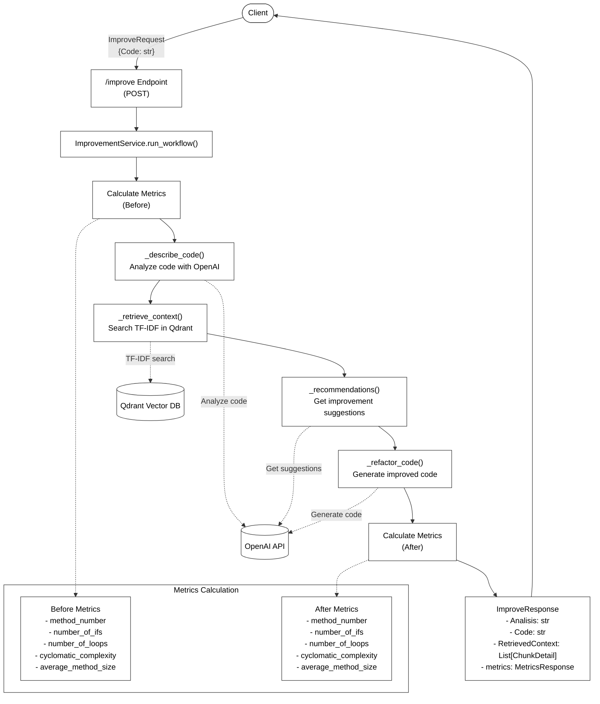

```mermaid
flowchart TD
    %% Nodes
    Client([Client])
    ImproveEndpoint["/improve Endpoint\n(POST)"]
    RunWorkflow["ImprovementService.run_workflow()"]
    
    %% Workflow steps
    CalcMetricsBefore["Calculate Metrics\n(Before)"]
    DescribeCode["_describe_code()\nAnalyze code with OpenAI"]
    RetrieveContext["_retrieve_context()\nSearch TF-IDF in Qdrant"]
    GetRecommendations["_recommendations()\nGet improvement suggestions"]
    RefactorCode["_refactor_code()\nGenerate improved code"]
    CalcMetricsAfter["Calculate Metrics\n(After)"]
    
    %% Response
    Response["ImproveResponse\n- Analisis: str\n- Code: str\n- RetrievedContext: List[ChunkDetail]\n- metrics: MetricsResponse"]
    
    %% External services
    OpenAI[(OpenAI API)]
    Qdrant[(Qdrant Vector DB)]
    
    %% Metrics
    subgraph Metrics[Metrics Calculation]
        MetricsBefore["Before Metrics\n- method_number\n- number_of_ifs\n- number_of_loops\n- cyclomatic_complexity\n- average_method_size"]
        MetricsAfter["After Metrics\n- method_number\n- number_of_ifs\n- number_of_loops\n- cyclomatic_complexity\n- average_method_size"]
    end
    
    %% Flow connections
    Client -->|"ImproveRequest\n{Code: str}"| ImproveEndpoint
    ImproveEndpoint --> RunWorkflow
    RunWorkflow --> CalcMetricsBefore
    CalcMetricsBefore --> DescribeCode
    DescribeCode --> RetrieveContext
    RetrieveContext --> GetRecommendations
    GetRecommendations --> RefactorCode
    RefactorCode --> CalcMetricsAfter
    CalcMetricsAfter --> Response
    Response --> Client
    
    %% Service connections
    DescribeCode -.->|"Analyze code"| OpenAI
    RetrieveContext -.->|"TF-IDF search"| Qdrant
    GetRecommendations -.->|"Get suggestions"| OpenAI
    RefactorCode -.->|"Generate code"| OpenAI
    
    %% Metrics connections
    CalcMetricsBefore -.-> MetricsBefore
    CalcMetricsAfter -.-> MetricsAfter

    %% Styling
    classDef client fill:white,stroke:#333,stroke-width:1px,color:black
    classDef endpoint fill:white,stroke:#333,stroke-width:1px,color:black
    classDef service fill:white,stroke:#333,stroke-width:1px,color:black
    classDef external fill:white,stroke:#333,stroke-width:1px,color:black
    classDef metrics fill:white,stroke:#333,stroke-width:1px,color:black
    
    class Client client
    class ImproveEndpoint,Response endpoint
    class RunWorkflow,CalcMetricsBefore,DescribeCode,RetrieveContext,GetRecommendations,RefactorCode,CalcMetricsAfter service
    class OpenAI,Qdrant external
    class MetricsBefore,MetricsAfter,Metrics metrics
```
